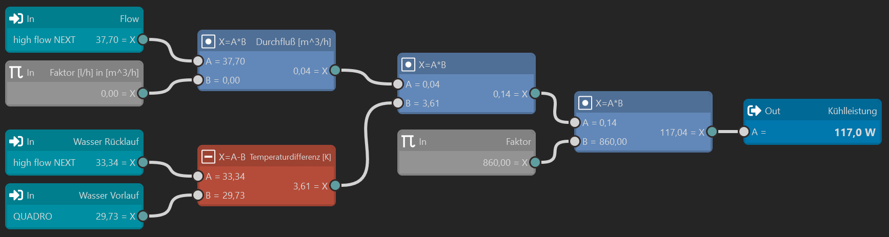
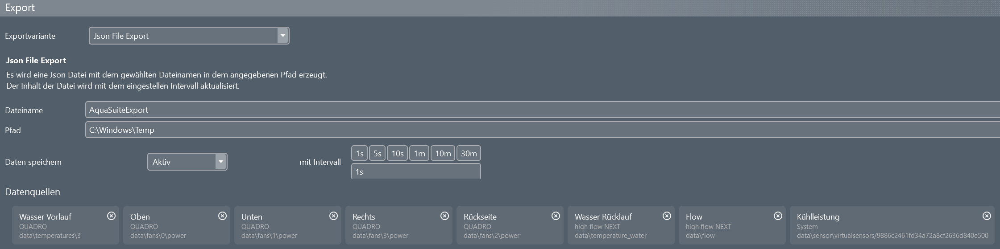

# AquaSuite - to SteelSeries Engine APEX Pro LCD
This project demonstrates how to display telemetry data from the AquaSuite Software of your PC water cooling system on your APEX Pro keyboard. Note that it is meant as technology demonstrator only, the telemetry endpoints are hard-coded, so is the path to the JSON export.

## 1. Overview
I wanted to show some important data such as the liquid temperature, the fan power and the current flow on of my AquaComputer devices and custom cooling loop on an external display. While some components already feature OLED screens, the machine sits under my desk, and therefore, I cannot watch the displays easily.

Putting an extra display, such as one of the VISION, on the desk, was also a no-go, because it's an additional thing and it needs a quite sturdy USB wire.

I decided to use the APEX Pro keyboard's OLED instead, because it is in view already, and they offer a JSON-API to display data there.

At the end of the day, it will look like this:
* Temperature  display  
  
* Flow-Meter (sensore setup required!)  
  
* Cooling power (sensor setup required!)  
  

## 2. Prerequisites
Some hardware is required for this script to work and run properly.
* An [aquacomputer water cooling](https://shop.aquacomputer.de/Wasserkuehlung:::7.html) system with at least:
  * a flow sensor (dedicated or calculated by the pump),
  * a fan controller,
  * and a temperature sensor, preferrably after the heat sources.
* A [SteelSeries APEX Pro](https://steelseries.com/de-de/gaming-keyboards/apex-pro-gen-3?keyboardSize=fullSize&connectivityType=wired&keyboardLanguage=english&color=black) keyboard with a 128x40 pixel OLED screen. I tested the APEX Pro and the APEX Pro Gen 3.

> [!NOTE] 
> In theory, all SteelSeries devices with an OLED screen should work, but you'd need to adapt the code to generate an image in the correct size. The SteelSeries GG Software is quite picky when it comes to incoming data.

## 2. Installation
You need to install and configure several things until the data is displayed.

### 2.1 AquaSuite Sensor Setup
First, make sure that you have the sensor data available that you want to display. Here's my setup, yours might be different.

#### 2.1.1 Temperature Sensor
As my HighFlow sensor is placed *after* CPU and GPU, and *before* any radiators, I use its sensor for the cooleant's return temperature ("Rücklauf") value in `°C`.

#### 2.1.2 Flow Meter Sensor
Also, my HighFlow sensor is used to meassure the flow in `l/h` directly. In case you don't have one, you could also use the estimation from your D5 next pump, after configuring and calibrating it through the AquaSuite Software.

#### 2.1.3 Cooling Power [Software] Sensor 
For this value, I use the Playground function to create a software sensor that calculates the cooling power in `W`, and it needs a temperature sensor on the coolest point (in my case this is an analogue temperature sensor wrapped around the output terminal of the last radiator), and at the hottest point (e.g., right after the CPU/GPU combo). In my case, it's the water temperature sensor of the HighFlow component.

The software sensor then looks like this:

There are two constants defined, values as follows:
* `Faktor [l/h] in [m^3/h]`: `0.0010`
* `Faktor`: `860.0000` (this one calculates the power dissipation in `W`)

> [!NOTE]
> Of course, in case you have the wired external hardwware temperature sensor connected to the HighFlow sensor, **and** in case it is placed directly before any heat source (ideally after the radiators to get the lowest temperature of the loop), you can use the power value from the sensor directly.  
It unfortunately does not support an external data source for this value.

#### 2.1.4 Fans Power Sensors
This is easy - as I have four fan groups, I simply use their respective output power from the Quattro fan controller to have values for the fan power bars on the right.

> [!NOTE]
> The sensor should output a percentage value (0-100%).  
> Also, the first letter of the sensor's name is used on the OLED screen - you should name them appropriately.

### 2.2 AquaSuite Log Export
* Open the AquaSuite software and navigate to the `Data Logger` --> `Automated Data Export` section.
* There, configure an automated export:
  * JSON format
  * every second
  * `C:\Windows\Temp\AquaSuiteExport.json`
> [!NOTE]
> I also tried the shared memory export, but could not get the python script to read the data.  
> Also, make sure to add the desired sensors to the output by using the `(+) add` button on that page.

It should look something like this:

### 2.3 AquaSuite Log Export
Lastly, the mapping between the JSON path of the data and the variables here in the script needs to be adapted. Have a look at the exported JSON file and take note of the `DataSourcePath` elements in each exported sensor node.

Those are required to match the expected data for the screen image creation.

You need to modify the filter lines around line `285` and below to adapt the mapping to your output. I left mine in there to show some examples.

Some notes regarding the bar output of the fans:
* The code is designed to display 1-4 fans.
* The bars will start to be drawn from the right.
* Therefore, if you have less than 4 fans or fan groups, just remove the mapping(s) not required.
* Also make sure to reference a sensor yielding a percentage value between `0` and `100`.

## Usage
Simply execute the main program with `py .\main.py`.

In case you want the output image saved to disc: `py .\main.py --save-output`.

## Requirements
- Python 3.9+
- AquaSuite Software
- AquaComputer water cooling components for fans, temperature and flow.

## License
MIT

## Contributing
Pull requests of course welcome.